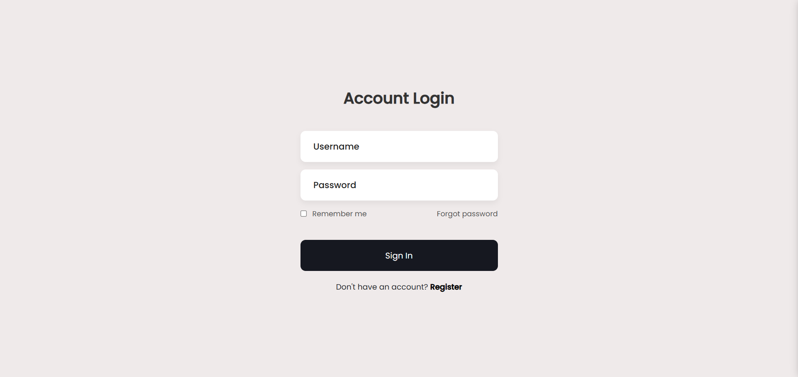
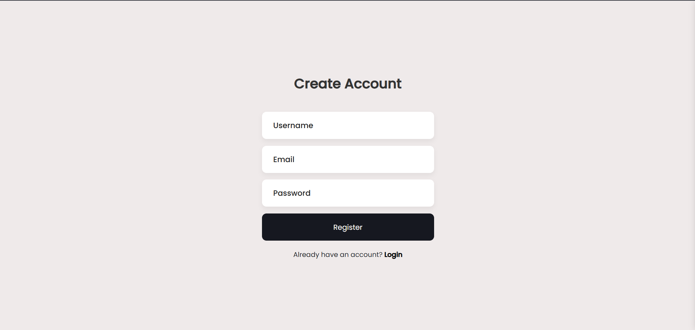
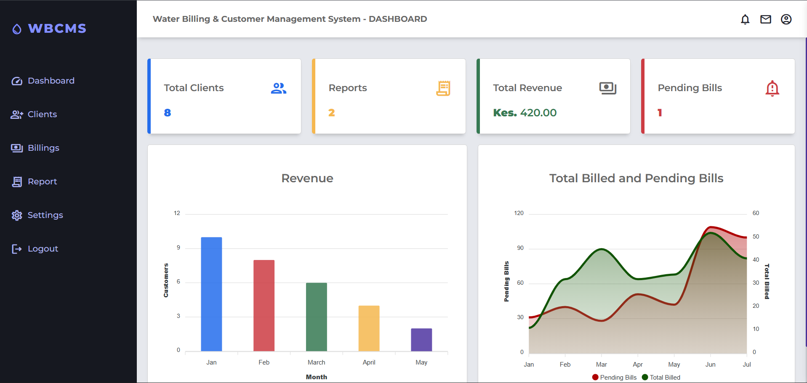
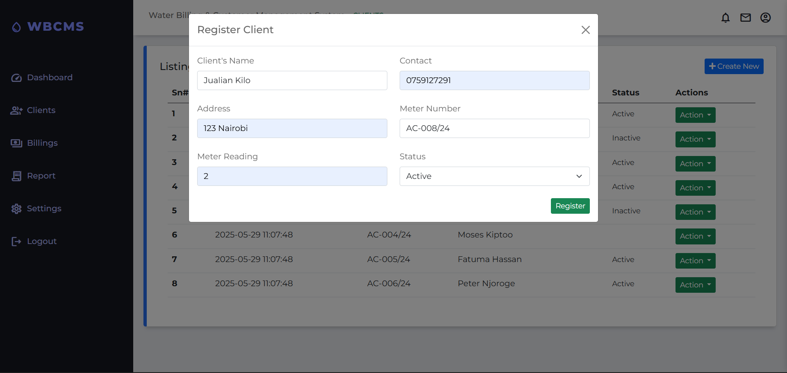
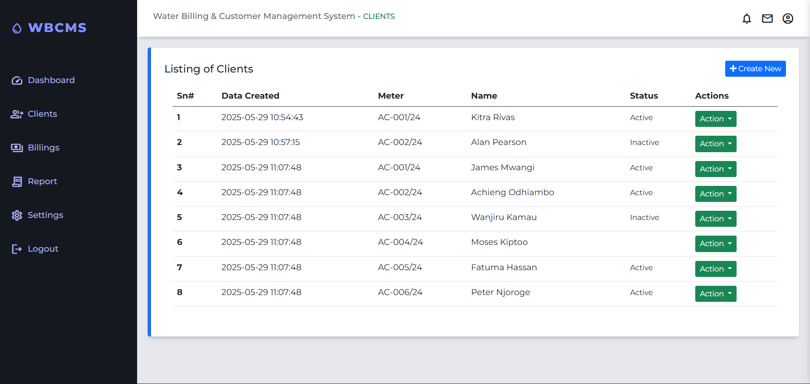
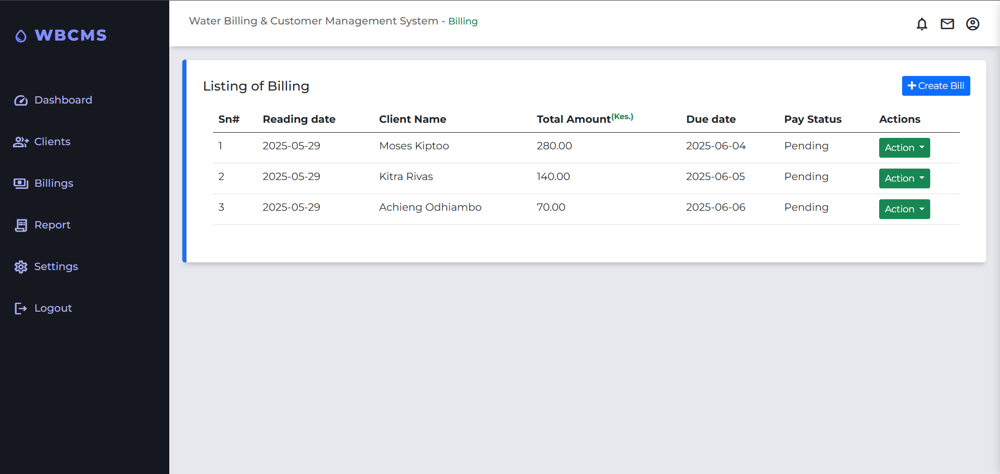

# Water Billing & Customer Management System (WBCMS)

[](https://opensource.org/licenses/MIT)
[](https://www.php.net/)
[](https://www.mysql.com/)

## Overview
The **Water Billing & Customer Management System (WBCMS)** is a robust, web-based solution designed for water service providers to streamline client management, meter tracking, and billing processes. It automates the generation of account numbers, tracks meter readings, and provides real-time data visualization via a comprehensive dashboard.

Built with a focus on simplicity and efficiency, WBCMS helps utility providers move away from manual record-keeping to a digital, error-free environment.


## Key Features

### Client Management
*   **Unique Account Generation:** Automatic generation of sequential account numbers using the format `AC-###/YYYY`.
*   **Comprehensive Profiles:** Manage names, phone numbers, addresses, and status (Active, Inactive, Pending).
*   **Dynamic Search:** Easily filter and find clients within the database.

### Billing & Metering
*   **Meter Reading Tracking:** Records current and previous readings to calculate consumption.
*   **Automated Billing:** Generates bills based on consumption rates.
*   **Billing History:** Maintain a transparent record of all previous invoices for every client.

### Dashboard & Analytics
*   **Visual Insights:** Integrated with **ApexCharts** for graphical representation of revenue and client statistics.
*   **Real-time Stats:** Quick view of total clients, active bills, and monthly revenue.

### Administrative Tools
*   **User Authentication:** Secure login and registration system for staff.
*   **System Settings:** Configure utility rates and system-wide parameters.
*   **Reporting:** Generate detailed reports for administrative review.

---

## Tech Stack

**Backend:** 
*   PHP (Vanilla)
*   MySQL Database

**Frontend:**
*   HTML5 & CSS3
*   Bootstrap 5 (Responsive Framework)
*   JavaScript (ES6)
*   ApexCharts (Data Visualization)

**Server Environment:**
*   Apache (XAMPP / WAMP / MAMP)


## Screenshots

| 1. App Login | 2. Registration |
| :---: | :---: |
|  |  |

| 3. Dashboard Overview | 4. Client Registration |
| :---: | :---: |
|  |  |

| 5. Clients List | 6. Billing Interface |
| :---: | :---: |
|  |  |


## Installation & Setup

1.  **Clone the Repository**
    ```bash
    git clone https://github.com/nzyoka10/water-billing.git
    ```

2.  **Server Setup**
    *   Move the project folder to your local server directory (e.g., `C:/xampp/htdocs/wbcms`).
    *   Start **Apache** and **MySQL** from your XAMPP/WAMP control panel.

3.  **Database Configuration**
    *   Open PHPMyAdmin (`http://localhost/phpmyadmin`).
    *   Create a new database named `wbcms`.
    *   Import the SQL file located in the `/database` folder.

4.  **Configure Connection**
    *   Navigate to `config/` folder.
    *   Update the database credentials (host, username, password, and db_name) to match your local environment.

5.  **Access the App**
    *   Open your browser and go to `http://localhost/wbcms`.


## Project Structure
```text
├── config/          # Database connection settings
├── css/             # Custom stylesheets
├── database/        # SQL export files
├── docs/            # Project documentation
├── img/             # UI assets and logos
├── inc/             # Reusable components (Header, Footer, Sidebar)
├── js/              # Frontend logic and Chart initializations
├── screenshot/      # Application preview images
└── *.php            # Core application modules (Billing, Clients, Dashboard)
```

## Contributing
Contributions are welcome! If you'd like to improve the system:
1. Fork the Project.
2. Create your Feature Branch (`git checkout -b feature/AmazingFeature`).
3. Commit your Changes (`git commit -m 'Add some AmazingFeature'`).
4. Push to the Branch (`git push origin feature/AmazingFeature`).
5. Open a Pull Request.
